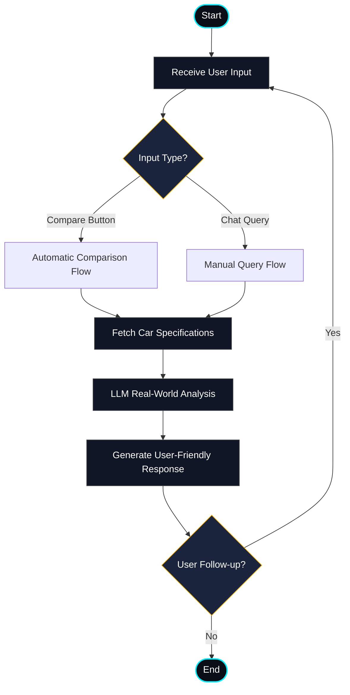

# DriveMatrix — Specs & Comparison Deck with AI Implications Agent

DriveMatrix is a premium car specifications database and comparison platform (inspired by CarDekho) integrated with a backend **LangGraph AI Agent** that translates dry, numeric specifications (like horsepower, torque, drivetrain, and battery capacity) into clear, real-world driving implications (overtaking speed, slippery weather grip, cabin utility, and road comfort).

---

## 📁 Project Structure

```
Litmus-Prac/Cars/
├── backend/
│   ├── app/
│   │   ├── data/
│   │   │   └── rag_docs/           # Downloaded RAG text sheets
│   │   ├── __init__.py
│   │   ├── agent.py               # LangGraph state graph & routing logic
│   │   ├── main.py                # FastAPI endpoints (Start & Review routes)
│   │   ├── rag.py                 # Simple local RAG TF-IDF retriever
│   │   └── schemas.py             # Pydantic state & request schemas
│   ├── requirements.txt           # Python dependencies
│   ├── run.py                     # FastAPI server startup script
│   └── verify_agent.py            # Local agent verification test harness
├── src/
│   ├── assets/                    # Icons and UI graphics
│   ├── components/
│   │   ├── CarCard.tsx            # Glassmorphic grid card
│   │   ├── CarDetails.tsx         # Detailed overlay specs tab
│   │   ├── CompareDrawer.tsx      # Bottom sticky tray
│   │   ├── CompareModal.tsx       # Side-by-side spec winner matrices
│   │   └── FilterBar.tsx          # Dynamic search & ranges slider
│   ├── data/
│   │   └── cars.ts                # Main local mock car specifications dataset
│   ├── App.css                    # Component layout styles
│   ├── App.tsx                    # Main client dashboard view
│   ├── index.css                  # Design system variables & base CSS
│   └── main.tsx
├── .env.template                  # Environment template config
├── package.json                   # Vite dependencies
└── tsconfig.json
```

---

## ⚡ Setup Guide

### 1. Backend Server Setup (Python)

Ensure Python 3.14+ is installed.

```bash
# Navigate to the backend directory
cd Cars/backend

# Create a virtual environment
python3 -m venv venv

# Activate the virtual environment
source venv/bin/activate

# Install all backend packages (including local api dependencies)
pip install -r requirements.txt
pip install -U "langgraph-cli[inmem]"
```

Configure your API keys in `Cars/.env` (parent directory of backend):
```env
GROQ_API_KEY=your_groq_api_key
LANGCHAIN_TRACING_V2=true
LANGCHAIN_API_KEY=your_langsmith_api_key
LANGCHAIN_PROJECT=drive-matrix
```

Start the servers:
* **Option A: FastAPI Endpoints Server (Port 8000)**
  ```bash
  python run.py
  ```
* **Option B: LangGraph Dev Server (Port 2024)**
  ```bash
  langgraph dev --tunnel
  ```
* **Option C: Run Local Verification Unit Tests**
  ```bash
  python verify_agent.py
  ```

---

### 2. Frontend Client Setup (Vite + React)

```bash
# Navigate back to Cars root
cd Cars

# Install packages
npm install

# Run the development server
npm run dev
```
Open [http://localhost:5173/](http://localhost:5173/) in your browser.

---

## 🧠 AI Agent Architecture

The backend agent is orchestrated using **LangGraph** to process automatic comparison summaries and manual natural language queries:



### LangGraph State Memory
The agent implements a **sliding-window memory compression** algorithm:
- Keeps up to **50 active exchanges** in `chat_history`.
- When total count exceeds 50, the oldest message index is popped and folded into a persistent `summary` string: `S_t = (S_{t-1} + Message_old)`. This maintains sliding history while preserving context.

---

## 🎯 Groq Model Choice & Free-Tier Optimization

To accommodate **Groq free-tier rate limits**, we run a dual-tier model configuration:
1. **llama-3.3-70b-versatile**: Used **ONLY** for structured JSON output calls (via `.with_structured_output(...)` to extract user query intent). This leverages high reasoning power for intent identification without wasting rate limits on verbose text.
2. **llama-3.1-8b-instant**: Used for general string generation (generating the comparison reports and revision cycles). This model is lightning-fast, highly contextual, and has generous free-tier caps.

---

## 📈 Competitive Advantage vs Traditional Apps

Traditional sites like *CarDekho* or *CarWale* show tabular grids of numbers that confuse everyday consumers. DriveMatrix provides:
- **Intelligent Spec Synthesis**: Tells you *why* torque matters for overtaking on a wet road.
- **Winner Highlighting**: Evaluates which car holds the best specs (power, quickness, value) under actual metrics.
- **Local RAG Integration**: Indexes real mechanical concepts and charger network documents locally using a TF-IDF vector database, preventing LLM hallucination of capabilities.

---

## 📋 Project Backlogs & Limitations

- [ ] **No LLM Evals**: Needs an evaluation suite (such as *Ragas* or *TruLens*) to verify accuracy of spec-implications mapping over test datasets.
- [ ] **Basic RAG**: Relies on a local TF-IDF model instead of advanced dense embeddings.
- [ ] **Deployment**: Lacks cloud staging infrastructure (Docker/Kubernetes).
- [ ] **Visual Mock Variations**: Does not have generation of manual car modifications (which are popular among enthusiast buyers but missing in traditional car catalogs).

---

## 🚀 Future Roadmap (With More Time)

1. **Advanced RAG (C-RAG / Self-RAG)**: Introduce Corrective/Self-Retrieval to automatically query search APIs if local RAG documents lack specific vehicle specs.
2. **Neo4j Graph Database**: Map user comparison queries in a graph database to identify cross-brand competition graphs (e.g. mapping that users looking at Porsche Taycan also compare Tesla Model S 80% of the time).
3. **Prompt Compilation (DSPy)**: Use DSPy to declaratively optimize prompt weights based on metric evaluations instead of manual editing.
