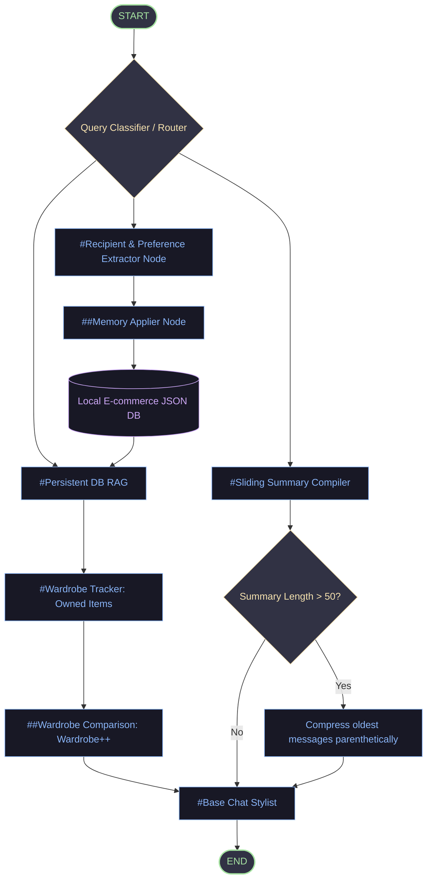

# Aura Styling: E-Commerce Wardrobe Tracker & AI Fashion Assistant

> A modular multi-agent stylist orchestrating customer profile RAG, persistent wardrobe tracking, styling upgrades, and dialogue memory consolidation.

---

## 1. System Architecture

The manual interactive route classifies queries to manage active styling interactions, persist style traits to the database, or compile parenthetical summary states.



---

## 2. Key Features & Functionality

- **Conversational Wardrobe Tracker**: Stores and logs clothing items the customer already owns (e.g. `grey jacket`, `white sneakers`) in the database.
- **Wardrobe Contrast (Wardrobe++)**: Cross-references stylist recommendations with the customer's owned items. If a user asks to buy or inspect a duplicate (e.g., "what about a grey jacket?"), the assistant prompts: *"Don't you already have that [item]? Let's check out the Khaki Utility Jacket instead to make your wardrobe++"*.
- **Shopping Goals & Progress Indicators**: Dynamically tracks pieces needed (e.g. 4 target items) against current cart capacity.
- **Occupation-Tailored Styling**: Adapts recommendations to customer's job/role (comfortable smart casual looks for developers).
- **Dialogue Summary Compiler**: Consolidates conversation history exceeding 50 messages into parenthetical summary loops `( ( S + 1 ) + 2 )` to avoid token inflation.
- **E-Commerce Profile RAG**: Automatically queries profile sizing, likes, dislikes, clicks, and shopping preferences to inject context directly into styling prompts.
- **Pricing & Coupon Refusal Guardrails**: Blocks pricing, costs, shipping, and discount code discussions on both query and response levels.

---

## 3. Setup & Verification Guide

### 1. Installation & Environment Configuration
```bash
# Navigate to the project directory
cd Clothes

# Initialize Python virtual environment
python3 -m venv venv

# Activate the virtual environment
source venv/bin/activate

# Upgrade package manager and install dependencies
pip install --upgrade pip
pip install -r requirements.txt
```

### 2. Running the Test Suite
The project includes a comprehensive suite of **32 unit and integration tests** checking state, database, pricing guardrails, and APIs. Resets data automatically between runs.
```bash
# Execute pytest with PYTHONPATH configured
PYTHONPATH=. venv/bin/pytest
```

### 3. Starting the Uvicorn Server
```bash
# Start uvicorn server in reload mode
venv/bin/python -m uvicorn app.main:app --reload --host 127.0.0.1 --port 8000
```
- Open the high-fidelity UI dashboard in your web browser: **[http://127.0.0.1:8000/](http://127.0.0.1:8000/)**

---

## 4. Known Limitations & Backlogs

- **Mock E-commerce Database**: Stored in a local JSON structure (`app/data/db.json`) rather than a transactional relational database (PostgreSQL/SQLAlchemy).
- **Transient Memory State Checkpoints**: Using FastAPI local RAM to pass current session variables (`recipient_profiles`, `recipient`) between turns; lacks state persistence across server reboots.
- **Omission of Image Embeddings**: Wardrobe items are tracked purely via text representations; image-based clothing uploads are stubbed out.
- **Basic LLM Guardrail String Checks**: Enforcing price blocks via exact regex patterns rather than secondary classification models.

---

## 5. Future Roadmap

### Technical Architecture Upgrades
- **Database Migrations**: Refactor `db_store` to run on **PostgreSQL** with **Alembic migrations** for transactional e-commerce profile reads/writes.
- **Persistent Graph Checkpointing**: Wire LangGraph's native checkpointer to a Postgres instance to preserve conversation sessions across boots.
- **Containerization**: Package the FastAPI server, static assets, and local database file into a multi-stage **Docker** build.

### Production Readiness
- **Advanced RAG**: Integrate a local vector store (e.g., FAISS or Chroma) with local embeddings to search large product catalogs.
- **CI/CD Integrations**: Run the `pytest` test suite automatically via GitHub Actions on every pull request.
- **LLM Evals**: Add Ragas/Deepeval tracking metrics to evaluate styling suitability and confirm the absolute compliance of the pricing guardrails.
